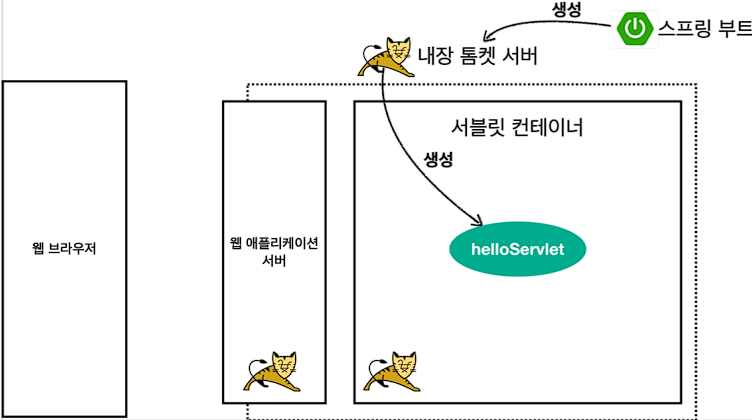

# 스프링 MVC 1편 - 백엔드 웹 개발 핵심 기술

 

## 목차
- [1. 웹 애플리케이션 이해](#1-웹-애플리케이션-이해)
- [2. 서블릿](#2-서블릿)
- [3. 서블릿, JSP, MVC 패턴](#3-서블릿-jsp-mvc-패턴)
- [4. MVC 프레임워크 만들기](#4-mvc-프레임워크-만들기)
- [5. 스프링 MVC - 구조 이해](#5-스프링-mvc---구조-이해)
- [6. 스프링 MVC - 기본 기능](#6-스프링-mvc---기본-기능)
- [7. 스프링 MVC - 웹 페이지 만들기](#7-스프링-mvc---웹-페이지-만들기)
- [8. 다음으로](#8-다음으로)
  <br><br>


## 1. 웹 애플리케이션 이해

<br><br>
<br><br>

## 2. 서블릿
### Hello 서블릿
스프링 부트 환경에서 서블릿 등록하고 사용해보자.

> 참고
> <br>서블릿은 톰캣 같은 웹 애플리케이션 서버를 직접 설치하고,그 위에 서블릿 코드를 클래스 파일로 빌드해서
올린 다음, 톰캣 서버를 실행하면 된다. 하지만 이 과정은 매우 번거롭다.
> <br>스프링 부트는 톰캣 서버를 내장하고 있으므로, 톰캣 서버 설치 없이 편리하게 서블릿 코드를 실행할 수
있다

- 스프링 부트 서블릿 환경 구성
  - `@ServletComponentScan`
    - 직접 등록해서 사용할 수 있도록 @ServletComponentScan 을 지원한다.
      <br><br>
  - 서블릿 등록하기
    ```java
    package hello.servlet.basic;
    
    import javax.servlet.ServletException;
    import javax.servlet.annotation.WebServlet;
    import javax.servlet.http.HttpServlet;
    import javax.servlet.http.HttpServletRequest;
    import javax.servlet.http.HttpServletResponse;
    import java.io.IOException;
    
    @WebServlet(name = "helloServlet", urlPatterns = "/hello")
    public class HelloServlet extends HttpServlet {
        
        @Override
        protected void service(HttpServletRequest request, HttpServletResponse response) throws ServletException, IOException {
            System.out.println("HelloServlet.service");
            System.out.println("request = " + request);
            System.out.println("response = " + response);
            
            String username = request.getParameter("username");
            System.out.println("username = " + username);
            
            response.setContentType("text/plain");
            response.setCharacterEncoding("utf-8");
            response.getWriter().write("hello " + username);
       }
    }
    ```
    - `@WebServlet`서블릿 애노테이션
      - name: 서블릿 이름
      - urlPatterns: URL 매핑
        <br><br>
    - HTTP 요청을 통해 매핑된 URL이 호출되면 서블릿 컨테이너는 다음 메서드를 실행한다.
    - `protected void service(HttpServletRequest request, HttpServletResponse response`
  <br><br>
  - 서블릿 컨테이너 동작 방식 설명
    - 내장 톰캣 서버 생성<BR>
    
      <BR><BR>
    - HTTP 요청, HTTP 응답 메세지<BR>
    
      <BR><BR>
    - 웹 애플리케이션 서버의 요청 응답 구조<BR>
    
      <BR><BR>
    > 참고: HTTP 응답에서 Content-Length는 웹 애플리케이션 서버가 자동으로 생성해준다.
  
  - welcome 페이지 추가
    - 지금부터 개발할 내용을 편리하게 참고할 수 있도록 welcome 페이지를 만들어두자.
    - `webapp` 경로에 `index.html`을 두면 http://localhost:8080 호출 시 `index.html`페이지가 열린다.
  <br><br>
  <br><br>
### HttpServletRequest - 개요
- HttpServletRequest 역할
  - HTTP 요청 메시지를 개발자가 직접 파싱해서 사용해도 되지만, 매우 불편할 것이다. 서블릿은 개발자가
  HTTP 요청 메시지를 편리하게 사용할 수 있도록 개발자 대신에 HTTP 요청 메시지를 파싱한다. 그리고 그
  결과를 `HttpServletRequest` 객체에 담아서 제공한다.
  <br><br>
HttpServletRequest를 사용하면 다음과 같은 HTTP 요청 메시지를 편리하게 조회할 수 있다.
    <br><br>
- HTTP 요청 메시지
  ```
  POST /save HTTP/1.1
  Host: localhost:8080
  Content-Type: application/x-www-form-urlencoded
  username=kim&age=20 
  ```
  - START LINE
    - HTTP 메소드
    - URL
    - 쿼리 스트링
    - 스키마, 프로토콜
  - 헤더
    - 헤더 조회
  - 바디
    - form 파라미터 형식 조회
    - message body 데이터 직접 조회
      <br><br>
      <br><br>
  - HttpServletRequest 객체는 추가로 여러가지 부가기능도 함께 제공한다.
      <br><br>
    - 임시 저장소 기능
      - 해당 HTTP 요청이 시작부터 끝날 때 까지 유지되는 임시 저장소 기능
        - 저장: `request.setAttribute(name, value)`
        - 조회: `request.getAttribute(name)`
          <br><br>
    - 세션 관리 기능
      - `request.getSession(create: true)`

  >중요: HttpServletRequest, HttpServletResponse를 사용할 때 가장 중요한 점은 이 객체들이 HTTP 요청
메시지, HTTP 응답 메시지를 편리하게 사용하도록 도와주는 객체라는 점이다. 따라서 이 기능에 대해서
깊이있는 이해를 하려면 **HTTP 스펙이 제공하는 요청, 응답 메시지 자체를 이해**해야 한다.

  <br><br>
  <br><br>
### HttpServletRequest - 기본 사용법

<br><br>
<br><br>
### HTTP 요청 데이터 - 개요

<br><br>
<br><br>
### HTTP 요청 데이터 - GET 쿼리 파라미터

<br><br>
<br><br>
### HTTP 요청 데이터 - POST HTML Form

<br><br>
<br><br>
### HTTP 요청 데이터 - API 메세지 바디 - 단순 텍스트

<br><br>
<br><br>
### HTTP 요청 데이터 - API 메세지 바디 - JSON

<br><br>
<br><br>
### HttpServletResponse - 기본 사용법

<br><br>
<br><br>
### HTTP 응답 데이터 - 단순 텍스트, HTML

<br><br>
<br><br>
### HTTP 응답 데이터 - API JSON

<br><br>
<br><br>
### 정리


  <br><br>
  <br><br>

## 3. 서블릿, JSP, MVC 패턴

<br><br>
<br><br>

## 4. MVC 프레임워크 만들기

<br><br>
<br><br>

## 5. 스프링 MVC - 구조 이해

<br><br>
<br><br>

## 6. 스프링 MVC - 기본 기능

<br><br>
<br><br>

## 7. 스프링 MVC - 웹 페이지 만들기

<br><br>
<br><br>

## 8. 다음으로

<br><br>
<br><br>
